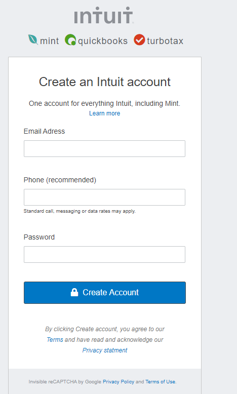

# HTML Form - Mint.com's Sign Up Form

> This project consists of building an HTML document that matches the appearance of [mint.com’s sign-up page](https://accounts.intuit.com/signup.html). The page was structured into three main containers: header, main, footer. The header contains elements relevant to signing into an existing account. The main contains the actual form and any elements relevant to the context of signing up for an account and any terms and policies a user needs to be aware of. The final element, footer, contains general information about the company and provides relevant links. While we couldn't match the style perfectly to the source web-page, we managed to use placeholders that were similar enough to satisfy the needs of this project. The project itself is static and not does not function as a real form. This project was used as an exercise to recreate the User Interface of an existing form.

## Built With

- HTML5
- CSS3
- Font Awesome

## Live Demo

[Live Demo Link](https://antonyotero.github.io/html-form/)

## Authors

👤 **Ahmed Amin**

- GitHub: [@AhmedAmin90](https://github.com/AhmedAmin90)
- Twitter: [@AhmedAmin12383](https://twitter.com/AhmedAmin12383)
- LinkedIn: [ahmed-amin-quality](https://www.linkedin.com/in/ahmed-amin-quality/)

👤 **Antony Otero**

- GitHub: [@AntonyOtero](https://github.com/AntonyOtero)
- Twitter: [@AntonyOtero](https://twitter.com/AntonyOtero)
- LinkedIn: [antonyotero](https://www.linkedin.com/in/antonyotero/)

## 🤝 Contributing

Contributions, issues, and feature requests are welcome!

Feel free to check the [issues page](https://github.com/AntonyOtero/signup-form/issues).

## Show your support

Give a ⭐️ if you like this project!

## Acknowledgments

- [@microverseinc](https://github.com/microverseinc)

## 📝 License

This project is [MIT](LICENSE) licensed.
